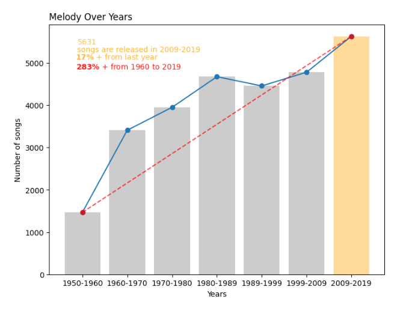
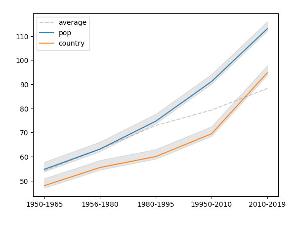
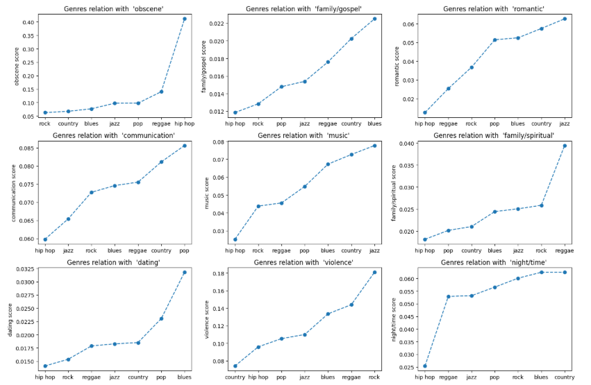
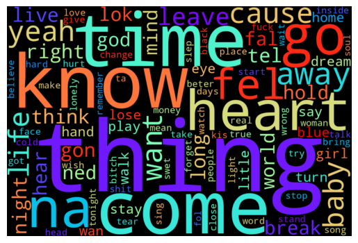

# [1] Predicción del género musical (Kaggle con dataset completo)

[https://www.kaggle.com/code/brjapon/songs-analysis-with-word2vec-1950-2019]()
El dataset contiene 28.372 canciones con 31 columnas.

Cuaderno Jypiter en directorio: `./Kaggle-runnig-FullDataset`

## Canciones por intervalos de tiempo

### 7 intervalos del rango total de años

```python
df_songs = pd.read_csv('/kaggle/input/music-dataset-1950-to-2019/tcc_ceds_music.csv')

## Preserving our old datset
df_range = df_songs.copy()

# Create interval
df_songs['year_range']=pd.cut(df_songs['release_date'], bins=7,precision=0)

# Bar plot
plt.bar(interval,songs_in_year,align='center',color=bar_colors,alpha= 0.4)
plt.ylabel('Number of songs')
plt.xlabel('Years')
plt.title('Melody Over Years',loc='left')
```



### 6 intervalos de 8 años

```python
# create some intervals, set bins of length 8
bins = [1950, 1965,1980,1995,2010,2019]

df_range['time_interval'] = pd.cut(df_range['release_date'], bins , right=True)
grouped_with_time_range = df_range.groupby('time_interval')['len'].mean()
values = grouped_with_time_range.values
intervals = ['1950-1965','1956-1980','1980-1995','19950-2010','2010-2019']
plt.plot(intervals, values, c='gray',linestyle='--',label='average',alpha=0.4,fillstyle='full')
plt.legend({'average' : label})

# plotting top genres from the dataset
genres = ['pop','country']
for genre in genres:
    filtered_df = df_range[df_range['genre'] == genre]
    grouped_with_time=filtered_df.groupby('time_interval')['len'].mean()
    values = grouped_with_time.values
    plt.plot(intervals, values ,linestyle='-', alpha=0.9,label=genre)
    plt.fill_between(intervals, values-1, values + 3, color='gray', alpha=0.2)
plt.legend()
```



1. *Trend says the length of songs is keep on increasingly (On average)*
2. *Genre 'Pop' has majority in the datset, For this reason pop songs length is much larger than the average*

## Dependencia del género respecto a las features del dataset

```
# lets analyse how genre show dependency on features

# setting up figure , and subplots
fig, axes = plt.subplots(3,3, figsize=(15,10))
types = ['obscene', 'family/gospel','romantic','communication','music','family/spiritual','dating','violence','night/time']

for i,feature in enumerate(types):
    row , col = i//3 , i%3
    genre = df_range.groupby('genre')[feature].mean().sort_values().index
    values = df_range.groupby('genre')[feature].mean().sort_values().values
    axes[row,col].plot(genre, values,marker='o', linestyle='--')
    axes[row,col].set_title("Genres relation with  '{}' ".format(feature))
    axes[row,col].set_ylabel('{} score'.format(feature))
plt.tight_layout()
```



Nube de palabras basada en Bag of Words (BoW):



## Predicción del género con Doc2Vec

```python
from gensim.models.doc2vec import TaggedDocument, Doc2Vec

# Preparing input for Doc2vec
def into_list(df,column):
    x =list(df[column].values)
    return x
```

Función para la definición y entrenamiento de un modelo Doc2Vec:

- Creación de embeddings de documentos (1 documento = letra de canción)

```
# Model building: function `word_to_vec`
# Set default vector_size = 150
def word_to_vec(input_list:list, output_list:list,vector_size=150, min_count = 5, epochs =40):

    tagged_data = [TaggedDocument(words = input_column, tags=[output_column]) for input_column , output_column, in zip(input_list, output_list)]

    model =Doc2Vec(vector_size =vector_size, min_count = min_count, epochs = epochs)
    model.build_vocab(tagged_data)
    model.train(tagged_data, total_examples=model.corpus_count,epochs=model.epochs)
    return model
```

Modelo predictivo del género de una canción (utiliza el modelo Doc2Vec entrenado):

- La función `word_to_vec` entrena el modelo de embeddings `Word2Vec`

```python
# Setting up pipeline
X_list = into_list(X,'lyrics')
y_list = into_list(y,'genre')

model = word_to_vec(X_list,y_list,vector_size=8000,epochs=30)
```

Función de predicción del género musical:

```python
def Predict_genre(model,text):
    text_vector = infer_vector(model, text)
    return model.dv.most_similar([text_vector],topn = 1)[0][0]

def infer_vector(model, text):
    return model.infer_vector([text])
```

Predicción para la letra de una canción:

```python
text = "How many roads must a man walk down Before you call him a man? How many seas must a white dove sail Before she sleeps in the sand? Yes, and how many times must the cannonballs fly Before they're forever banned?"
Predict_genre(model,text)
```

# [2] Calidad literaria de letras canciones

Tomamos una muestra de 500 canciones. El dataset completo contiene **28.372 canciones** con 31 columnas. Las que nos interesan para la tarea son:

* `artist_name` → artista
* `genre` → género musical
* `lyrics` → letra de la canción

## Embeddings basados en Word2Vec

Script `_NLP Project-Music_1950-2019\LQS-Word2Vec-FullDataset\LQS_Word2Vec.py`

#### 0) Preprocesamiento

* Segmenta la letra en **versos** (líneas).
* Tokeniza y limpia (minúsculas, quita puntuación), pero **no lematices** si tu Word2Vec fue entrenado en formas superficiales.

#### 1) Embeddings de verso

* Carga un `KeyedVectors` (Word2Vec)
* Embedding de verso = **media** de los vectores de sus tokens conocidos (OOV `` se ignoran)
* Guarda una matriz $V \in \mathbb{R}^{n \times d}$ (n = nº de versos).

#### 2) Métrica de calidad de letra de canción

Definimos los siguientes indicadores:

1. **Coherencia** $C$. Se calcula como la media del coseno entre **versos consecutivos**:

   $$
   C = \frac{1}{n-1}\sum_{i=2}^{n}\cos(V_{i-1}, V_i)
   $$

   * Para evitar premiar lo “demasiado predecible”, mapéalo a una campana con pico en $\mu$ (p. ej., 0.65):

   $$
   C' = \exp\!\left(-\frac{(\,C-\mu\,)^2}{2\sigma^2}\right) \quad (\sigma \approx 0.15)
   $$

   Resultado en $[0,1]$.
2. **Diversidad** $D$. Calcula cuán distintos son los versos entre sí (evita letras redundantes). Dos opciones:

   * Distancia al **centro** de la canción (`diversity_score(V, mode="centroid"`):

     $$
     \bar{v}=\frac{1}{n}\sum_i V_i,\quad D = 1 - \frac{1}{n}\sum_i \cos(V_i,\bar{v})
     $$
   * Más robusta basada en media de **pares** (`diversity_score(V, mode="pairwise"`). Usamos ésta en la implementación en Python:

     $$
     D = 1 - \frac{2}{n(n-1)}\sum_{i<j}\cos(V_i,V_j)
     $$

   Normaliza $D$ a $[0,1]$ con límites heurísticos (p. ej., cosenos típicos 0.3–0.9).
3. **Novedad** $N$ . Calcula la distancia semántica al **centroide de un corpus de referencia del género** (si no lo tienes, usa un centroide general de letras o de Wikipedia en ES como aproximación):

   $$
   g=\frac{1}{M}\sum_{m=1}^{M} G_m,\quad
   N = 1 - \frac{1}{n}\sum_i \cos(V_i, g)
   $$

   También normaliza a $[0,1]$.

> Con estos tres términos capturamos:
>
> * Continuidad temática (**C’**)
> * Variedad interna (**D**)
> * Alejamiento de clichés del género (**N**)

#### 3) Agregación en una única métrica

Definición de pesos simples ajustados con juicios humanos:

$$
\textbf{LQS} = 0.4\,C' \;+\; 0.35\,D \;+\; 0.25\,N
$$

**Limitación:** no captura rima/métrica/figuras retóricas.

**Workflow de implementación**:

1. **Tokenizar versos**: dividir cada letra en versos (líneas).
2. **Embeddings**: cargar un modelo Word2Vec pre-entrenado (ej. `glove-wiki-gigaword-100` o `word2vec-google-news-300` ) o **entrenarlo localmente**. Es este último el caso del código desarrollado.
3. **Calcular métricas** para cada canción:

   * **Coherencia** $C'$ entre versos consecutivos
   * **Diversidad** $D$ entre versos de la misma canción
   * **Novedad** $N$ respecto al centroide del género
4. **Combinar** con la fórmula:

   $$
   LQS = 0.4C' + 0.35D + 0.25N
   $$
5. **Agrupar resultados** por `genre` y `artist_name` para ver la calidad literaria media por segmento.

## Embeddings basados en Random Indexing (RI)

- Script `./LQS-RandomIndex/LQS_RandomIndexing.py`
- Resultados en `./LQS-RandomIndex\results`

Se trata de una alternativa ligera que permite un cálculo de embeddings más rápido que **Word2Vec**.

El **principio distribucional** dice:

> *“El significado de una palabra está determinado por los contextos en los que aparece.”*

En Word2Vec o GloVe, entrenamos un modelo para aprender esos contextos mediante redes neuronales o factorización.

**Random Indexing** (RI) evita el entrenamiento pesado: construye directamente vectores de palabras acumulando señales de contexto en  **espacios aleatorios de alta dimensión.**
Es un método de embeddings distribucionales, más ligero que Word2Vec o GloVe y que nació antes que ellos.

El concepto esencial **Random Indexing (RI)** está basado en estos 3 componentes:

- **Vocabulario**: Cada palabra $w$ en el vocabulario recibe un **vector índice aleatorio** $r_w \in \{-1,0,+1\}^d$, muy disperso (casi todo ceros, unos pocos ±1).

  * Ejemplo con $d=1000$, densidad 0.4%: solo 4 posiciones tienen ±1.
  * Estos vectores son casi ortogonales entre sí.
- **Acumulación distribucional**: Creamos un **vector semántico** $s_w \in \mathbb{R}^d$ para cada palabra (inicialmente todo ceros). Cada vez que $w$ aparece en un contexto (ventana de palabras alrededor), sumamos los vectores índice de sus palabras de contexto a $s_w$:

  $$
  s_w \;+=\; \sum_{c \in \text{contexto}(w)} r_c
  $$
- **Normalización**
  Tras procesar el corpus, normalizamos cada $s_w$ (norma L2, i.e. módulo de vector).

De esta forma $s_w$ refleja la suma de contextos de $w$, en un espacio de alta dimensión.

En resumen, los cálculos a realizar son:

1. Vector índice de palabra:

$$


$$

  r_w \in \{-1,0,+1\}^d, \quad \|r_w\|_0 \ll d

$$


$$

2. Vector semántico: $ s_w = \sum_{(w,c)} r_c $, donde la suma es sobre todos los contextos $c$ en que aparece $w$.

**Ejemplo**: supón el siguientes corpus:

```
el gato negro se sentó
el perro blanco jugaba
```

* Vocabulario = {el, gato, negro, perro, blanco, se, sentó, jugaba}
* Asignamos índices aleatorios $r_{el}, r_{gato}, \dots$.
* Ventana = 2.
* Cuando aparece “gato”, su vector semántico acumula $r_{el}$ y $r_{negro}$.
* Cuando aparece “perro”, acumula $r_{el}, r_{blanco}$.

Esto implica que:

* $s_{gato}$ y $s_{perro}$ son similares (ambos comparten contexto con “el”).
* $s_{negro}$ y $s_{blanco}$ también se relacionan.

#### Propiedades de RI

Se trata de un método de cálculo de embeddings que no requiere el entrenamiento de un modelo de machine learning.

✅ **Eficiente**: no requiere factorización ni backpropagation; basta recorrer el corpus una vez.
✅ **Escalable**: memoria controlada, no crece con vocabulario (todos los vectores son de dimensión fija $d$).
✅ **Ortogonalidad garantizada**: los índices aleatorios actúan como base casi ortogonal, así la señal de contexto se separa bien.
⚠️ **Calidad**: menos preciso que Word2Vec/BERT en semántica fina.
⚠️ **Dependencia del tamaño del corpus**: necesita mucho texto para estabilizar.

#### Comparativa de modelos de cálculo de embeddings

| Método                     | Cómo aprende                     | Pros                       | Contras                |
| --------------------------- | --------------------------------- | -------------------------- | ---------------------- |
| **LSA/SVD**           | Factorización de matriz          | Bueno en corpus pequeños  | Costoso en memoria     |
| **Random Indexing**   | Acumulación en espacio aleatorio | Barato, online, rápido    | Menor precisión       |
| **Word2Vec**          | Red neuronal skip-gram/CBOW       | Semántica rica, eficiente | Requiere entrenamiento |
| **BERT/Transformers** | Predicción contextual profunda   | Captura contexto dinámico | Muy pesado             |
